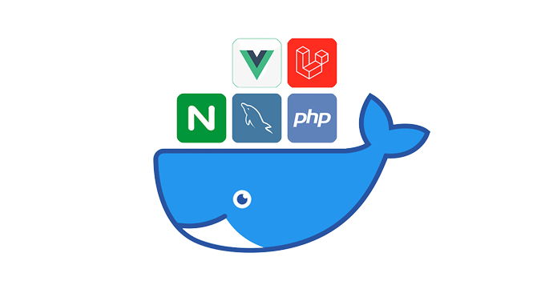

# Docker for Laravel & VueJs & TailwindCss
Welcome to the Docker Starter Kit for Laravel and Vue.js with TailwindCss! This repository contains all the necessary files to get a new project up and running quickly and easily using Docker.
<hr>
  <p align="center">
     
 </p>
 <hr>

##  Prerequisites

Make sure you have installed the following prerequisites in your development or production machine.
- PHP : Version 8.1
- Laravel: Version 9.x
- MySQL: Version 8
- Node: Version 16.15.0
  - Docker - <a href="https://docs.docker.com/get-docker/"> Download</a> & install Docker make sure that the latest docker version has been installed on your machine.  (mac / linux / windows),

### Getting Started on Windows
    You should ensure that Windows Subsystem for Linux 2 (WSL2) is installed and enabled. WSL allows you to run Linux binary executables natively on Windows 10. Information on how to install and enable WSL2 can be found within Microsoft's <a href="https://learn.microsoft.com/en-us/windows/wsl/install"> developer environment</a>  documentation. After installing and enabling WSL2,
    you should ensure that Docker Desktop is configured to use the WSL2 backend.
## Installation
1. ### Clone the repository:
    ```bash
    git clone https://github.com/Said20hr/Docker-Laravel-vueJs.git
    ```
2. ### Application structure
   
    ```
    .
    ├── backend             (Laravel 9.19)
    │   ├── app
    │   │   ├── Http
    │   │   └── Models
    │   ├── database
    │   │   └── migrations
    │   ├── routes
    │   └── storage
    │       └── logs
    └── frontend            (Vue.js 3.2.13)
      └── src
        ├── assets
        └── components
    ```

3. ### Install the necessary dependencies by running

    ```bash
   cd backend
   composer install
    ```
   Setup Environment for Development
    ```bash
   cd backend
   Copy .env.example to .env.
    ```
   Install Npm modules in vuejs app
    ```bash
   cd frontend
   npm install
    ```

4. ### Build the project by running:
    ```bash
    docker-compose up -d
    ```
5. ### Run the project

    1. - the frontend is by default served at [http://localhost:8080/](http://localhost:8080/)
    2. - the backend is by default served at [http://localhost:8001/](http://localhost:8001/)
    3. - If you need to change any ports (because you already have other services listening on it),
      update the .env file in the root folder (`backend/.env):

       ``` ini
        # You may change these
        FORWARD_BACKEND_PORT=8001
        FORWARD_FRONTEND_PORT=8080
       
        # You may change these, but then you should also update `backend/.env`
        FORWARD_DB_PORT=3306
        FORWARD_REDIS_PORT=3679
       ```

The app can be run using composer up in the app root folder, or ./vendor/bin/sail up in the backend folder. 
You can also change the server port in the backend/.env file.

## Contributing
This repository is open source and can be used by anyone who wants to start a Laravel and Vue.js app with Docker.
It's easy to use and customize to fit your needs.

## Licence
This project is open-source and licensed under the <a href="License.txt">MIT License</a>.
* Please note that the information above is a sample readme template and may not include all necessary details for your specific project. Replace the links, version numbers, and specific instructions for your project.

